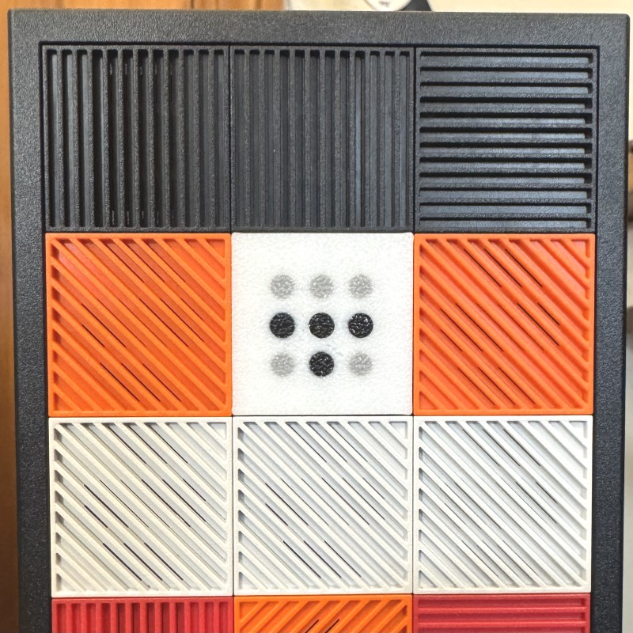

# Tailscale Framework Desktop Tile

Framework Desktop Tile with multi-color Tailscale logo embedded on the face.



## Printing

Ready to print 3MF and STL files are available to download from [Github Releases](https://github.com/tailscale/framework-desktop-tile/releases/tag/v0.1)

To create your own STLs from the OpenSCAD source use the following options.

### option 1: export script

```bash
./export-tailscale-tile.sh
```

This produces three STL files in `export/`:
- `tailscale-tile-0-black.stl` - base
- `tailscale-tile-1-gray.stl` - corner dots
- `tailscale-tile-2-white.stl` - T-shape dots

Import all three into your slicer and assign filament colors.

### option 2: manual STL export

In OpenSCAD, set `current_color` at line 17:
- `-1` - preview all colors
- `0` - black base only
- `1` - gray dots only
- `2` - white dots only

Render (F6) and export each as STL.

## Credits

Tile base geometry adapted from [Framework Desktop Tile Generator](https://www.printables.com/model/1397765-framework-desktop-tile-generator) by bonkrat.
